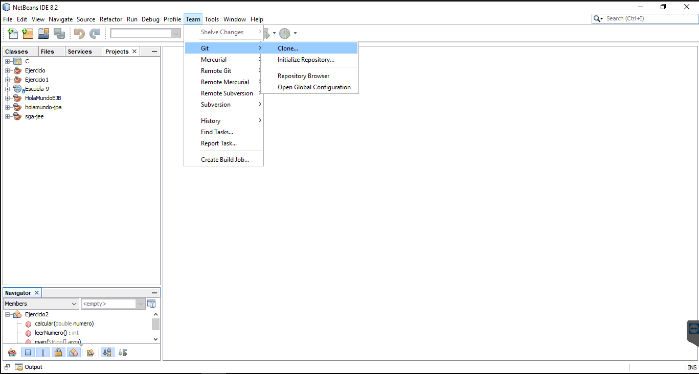
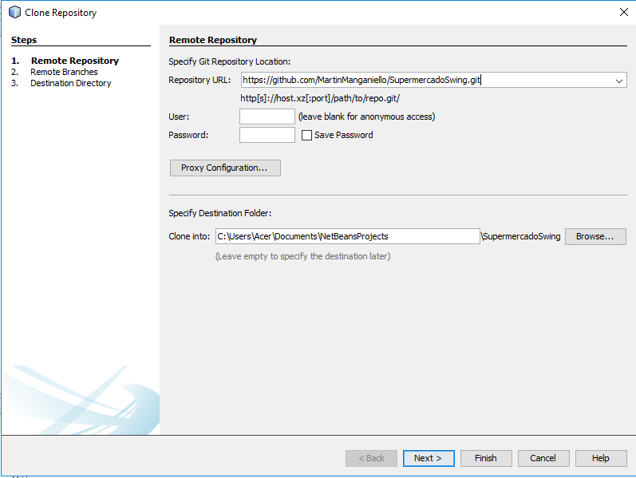
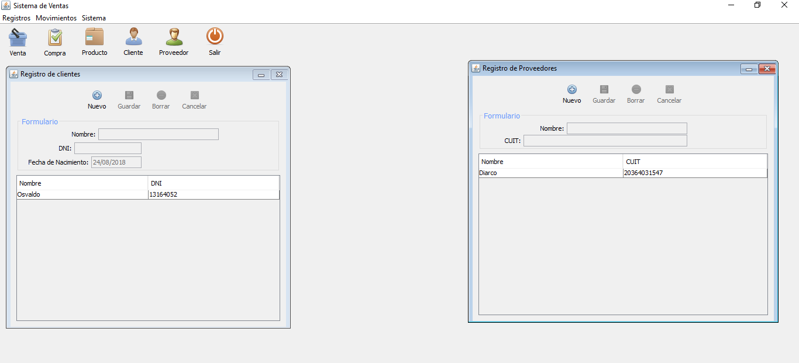

# Supermercado Swing

Tabla de Contenidos
=================
   * [Ejemplo de aplicación Swing](#ejemplo-de-aplicaci%C3%B3n-swing)
      * [Frameworks y Herramientas usadas](#frameworks-y-herramientas-usadas)
         * [Lenguaje](#lenguaje)
         * [Persistencia](#persistencia)
         * [Presentación / GUI](#presentaci%C3%B3n--gui)
         * [Gestor de Repositorios y Construcción](#gestor-de-repositorios-y-construcci%C3%B3n)
         * [IDE](#ide)
      * [Propósito](#prop%C3%B3sito)
      * [Base de datos](#base-de-datos)
      * [Como correr este proyecto](#como-correr-este-proyecto)

# Ejemplo de aplicación Swing
Este proyecto es un simple CRUD que simula un sistema de ventas y utiliza Java + Swing + JPA.

## Frameworks y Herramientas usadas
### Lenguaje
* Java 8 (JDK 1.8)
### Persistencia
* JPA 2.1
* Eclipselink 2.7.2
* MySQL 5.7.x
### Presentación / GUI
* Swing
### Gestor de Repositorios y Construcción
* Maven 4.0
### IDE
* Netbeans IDE 8.2

## Propósito
El principal propósito de este proyecto es servir como ejemplo para quienes deseen implementar las tecnologías anteriormente nombradas.

## Base de datos
La base de datos fue hecha en Workbench 6.3 CE a traves de un modelo. En la carpeta BD está el modelo ER y el script SQL.
1. Ejecutar el script SQL para crear la base de datos.

## Como correr este proyecto
1. Copiar el link para clonar el proyecto https://github.com/MartinManganiello/SupermercadoSwing.git
2. Abrir **Netbeans IDE**, ir a **Team**, "**Git**", click sobre "**Initialize Git**" pegar la dirección anteriormente copiada "**Siguiente...**". Click en "**Siguiente**", y por último "**Finish**".

3. Una vez hecho esto tendremos el proyecto abierto en NetBeans.
4. Antes de ejecutarlo debemos tener corriendo el servidor Mysql con la base de datos del Sistema de Ventas.

